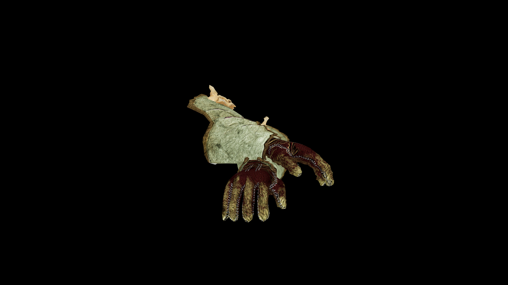

# Bone Gauntlets

The bone plating shields the hands and forearms, while the design allows for flexibility in movement.

## Item stats

  
Item stats

  <table>
    <tr><th>Weight</th><td>1.47</td></tr>
    <tr><th>Value</th><td>119.0</td></tr>
    <tr><th>Armor</th><td>5.26</td></tr>
  </table>

