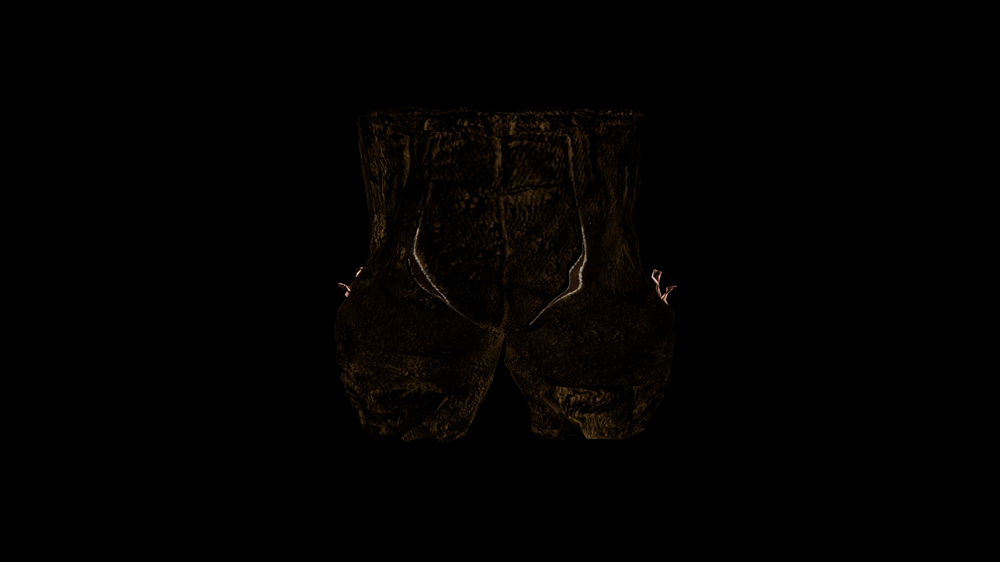

# Guard Greaves

Built for long shifts and sudden action, they help guards stay light on their feet while shielding against strikes and stray blows.

## Item stats

  
Item stats

  <table>
    <tr><th>Weight</th><td>3.47</td></tr>
    <tr><th>Value</th><td>181.0</td></tr>
    <tr><th>Armor</th><td>7.02</td></tr>
  </table>

