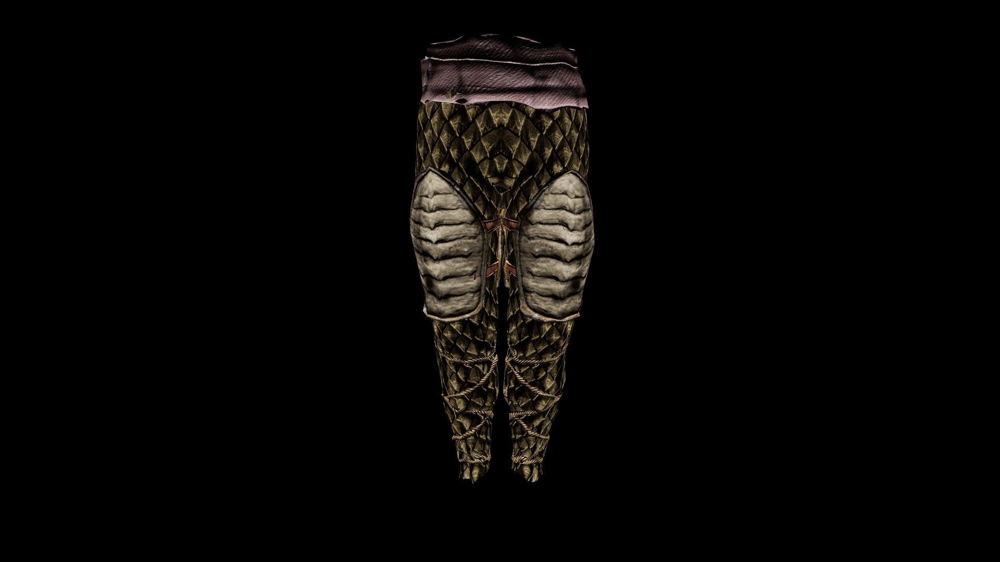

# Necro Greaves

They protect the legs while emanating an aura of death, slowing the movements of enemies who draw too close, as if the very ground beneath the wearer’s feet is cursed.

## Item stats

  
Item stats

  <table>
    <tr><th>Weight</th><td>24.39</td></tr>
    <tr><th>Value</th><td>925.0</td></tr>
    <tr><th>Armor</th><td>13.63</td></tr>
  </table>

