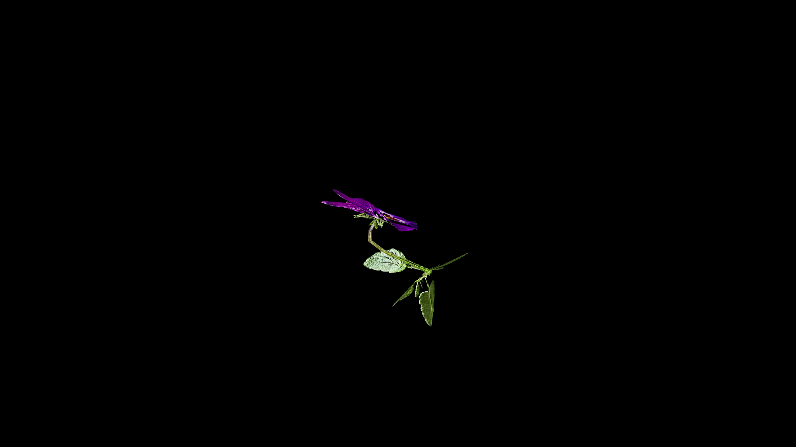

# African Violets

Saintpaulia is a section within Streptocarpus subgenus Streptocarpella, consisting of about ten species of herbaceous, perennial flowering plants in the family Gesneriaceae. They are native to Tanzania and adjacent areas of southeastern Kenya in eastern tropical Africa.

Delicate, velevet-petaled blooms that shimmer with a faint silvery sheen under moonlight. Alchemists prize the flowers for their subtle yet potent magic- when steeped into an elixir, they are ground into a fine violet powder and added to dream draughts, guiding the sleeper into visions of peace and clarity. 

Folklore warns, that blooms plucked without care will wither instantly, losing their power; only those harvested while humming softly to the plant will retain their full potency. 

## Item stats

  
Item stats

  <table>
    <tr><th>Weight</th><td>0.0</td></tr>
    <tr><th>Value</th><td>0.0</td></tr>
    <tr><th>Armor</th><td>0.0</td></tr>
  </table>

