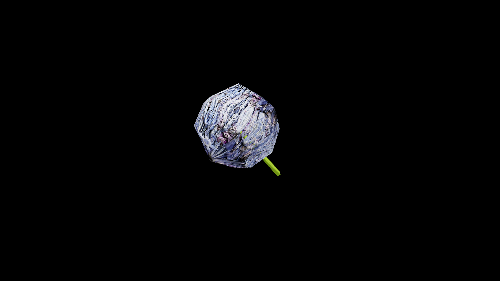

# Allium

Globe shaped clusters of starry blooms that emit a sharp, pungnet aroma. They are beloved by healters, their roots and bulbs hold a biting essence that wards against corruption, curses, and the touch of the undead. Crushed fresh allium releases a potent oil used in protective wards, barrier salves, and truth serums that compel honesty. 

In ancient grimoires, it is said that silver petaled allium blooms only bloom under a blood moon and can be brewed into an elixir that reveals hidden lies or banishes shadow-dwelling creatures. 

While common forms grow in sunlit fields and kitchen gardens, wild mountain allium is far more dangerous to harvest- its sharp scent draws hungry nightbeasts that feed on its rare magic vitality. 

## Item stats

  
Item stats

  <table>
    <tr><th>Weight</th><td>0.0</td></tr>
    <tr><th>Value</th><td>0.0</td></tr>
    <tr><th>Armor</th><td>0.0</td></tr>
  </table>

