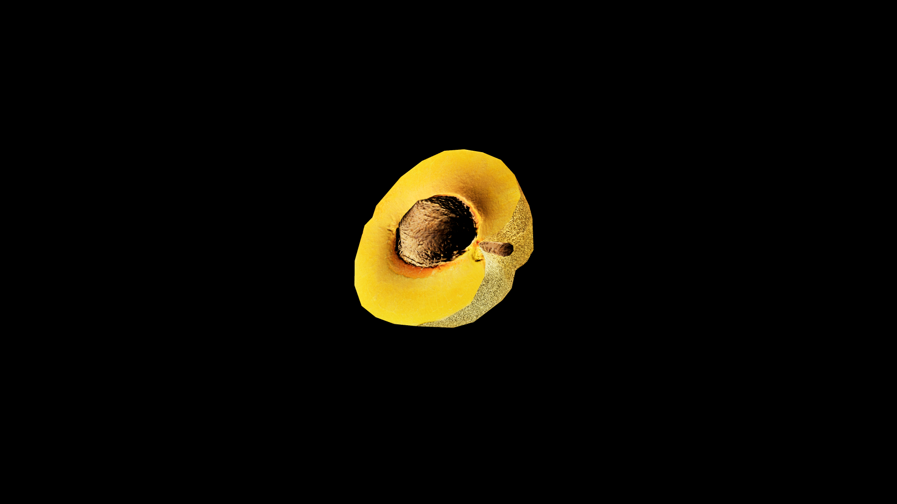

# Apricot

Sunkissed with velevety skin, and a sweet fragrant flesh. In alchemical practice, fresh apricots are cherished for their ability to restore energy, lift the spirit, and mend a weary heart when brewed into light, warming tonics. Dried apricots are often powdered and added to potions of endurance and long lasting vitality. Their stones- when carefully cracked and infused under the risin sun are said to enhance memory, sharpen wit, and reveal hidden truths. 

## Item stats

  
Item stats

  <table>
    <tr><th>Weight</th><td>0.0</td></tr>
    <tr><th>Value</th><td>0.0</td></tr>
    <tr><th>Armor</th><td>0.0</td></tr>
  </table>

