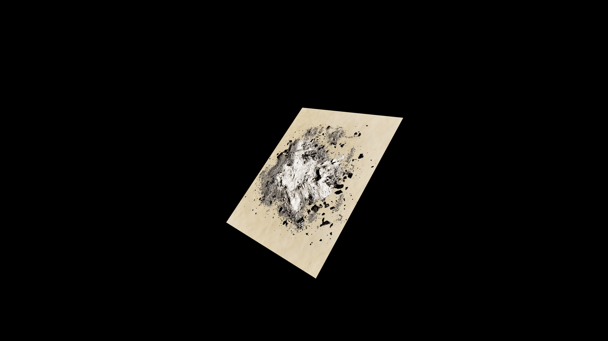

# Ash

The grey, powdery remnant of fires feast, holding within it the memory of what once was. Born from destruction, yet a fertile seed for creation, gathered from sacred hearths, its used in cleansing brews, banishment rituals, and protective wards, scattering away manevolent spirits. 

Folklore claims that ash taken from the remains of a phoenix feather can grant rebirth to the dying- though the price for such a gift is said to be steep indeed. 

## Item stats

  
Item stats

  <table>
    <tr><th>Weight</th><td>0.0</td></tr>
    <tr><th>Value</th><td>0.0</td></tr>
    <tr><th>Armor</th><td>0.0</td></tr>
  </table>

