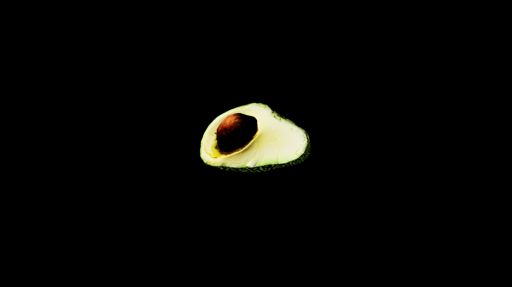

# Avocado

Rich green fleshed fruits encased in thick protective skins. Their smooth buttery texture hides potent magical properties. In the hands of skilled alchemists, the flesh is mashed into restorative salves and fortifying draughts that strengthen the body and quicken recovery from wounds. 

The large stone-hard pit at its centerr is far more than just a seed. It holds a condensed reservoir of earth magic, often ground into powder and added to brews hat enhance stamina, bolster courage, or anchor the spirit against possession. 

## Item stats

  
Item stats

  <table>
    <tr><th>Weight</th><td>0.0</td></tr>
    <tr><th>Value</th><td>0.0</td></tr>
    <tr><th>Armor</th><td>0.0</td></tr>
  </table>

