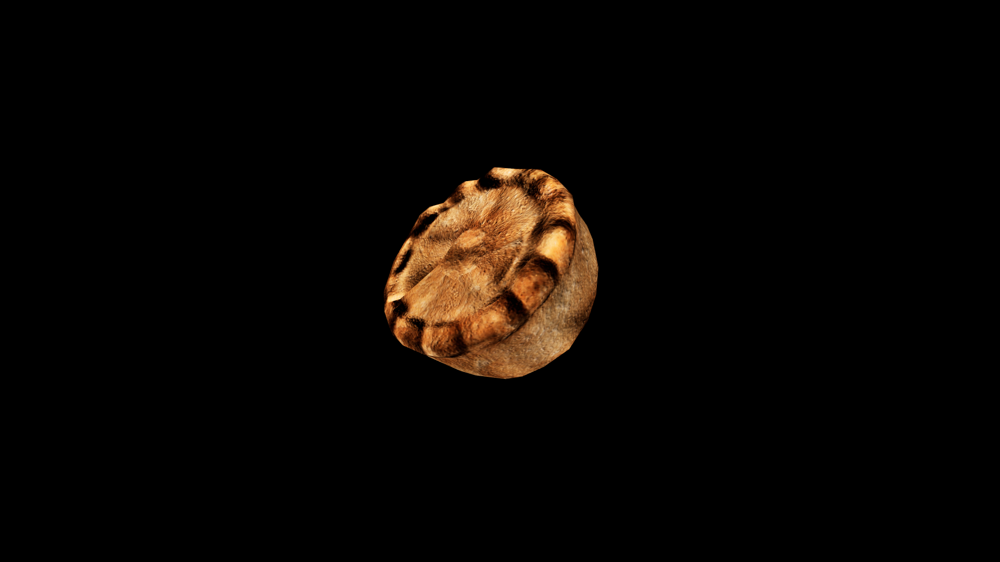

# Biscuit

 Freshly baked biscuits, still warm from the oven, are often infused with herbs, powders, or enchanted butters to turn them into vessels for restorative magic—perfect for delivering healing draughts or stamina‑boosting elixirs in a disguised form.  Sweet biscuits laced with honey are said to soothe the heart and calm troubled dreams, while savory ones fortified with garlic or allium ward away dark spirits and wandering curses.

## Item stats

  
Item stats

  <table>
    <tr><th>Weight</th><td>0.0</td></tr>
    <tr><th>Value</th><td>0.0</td></tr>
    <tr><th>Armor</th><td>0.0</td></tr>
  </table>

