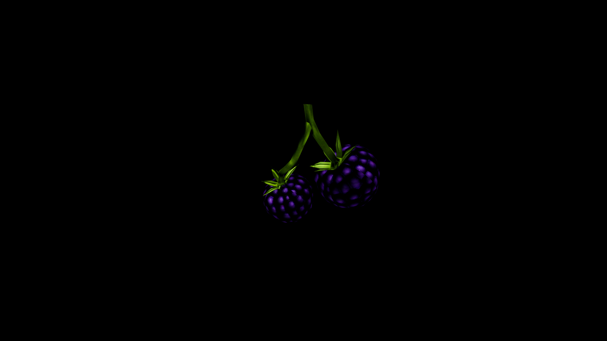

# Blackberry

Dark, jewel‑like clusters of sweetness and thorns, thriving along brambled hedges where mortal lands brush against the wild. Their plump, midnight‑hued fruit is prized in alchemy for its balance of vitality and subtle enchantment—fresh berries brewed into tonics restore energy, sharpen the senses, and heal minor wounds

In old tales, patches of blackberries mark the boundaries of fae territory, and those who pluck the fruit without offering thanks risk drawing the attention of trickster spirits.

## Item stats

  
Item stats

  <table>
    <tr><th>Weight</th><td>0.0</td></tr>
    <tr><th>Value</th><td>0.0</td></tr>
    <tr><th>Armor</th><td>0.0</td></tr>
  </table>

