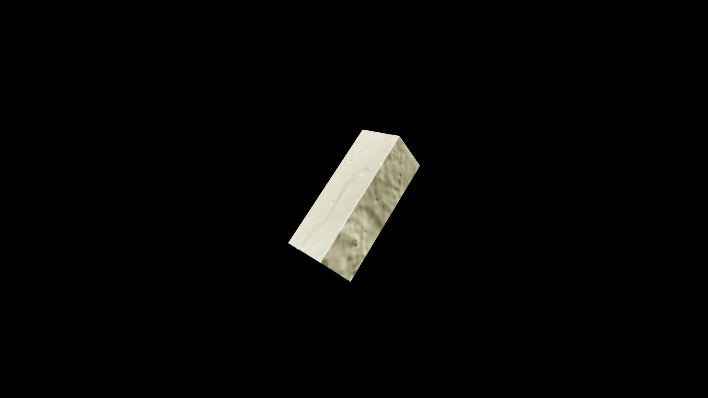

# Butter

When melted and blended with herbs, it becomes a potent carrier for healing magic, soothing burns, easing joint pain, and mending minor wounds. Butter is a golden, creamy alchemical base churned from the richest milk, carrying the warmth and vitality of the animals and fields from which it came. In potioncraft, butter is valued for its ability to bind and preserve delicate magical essences, allowing volatile ingredients to remain stable within salves, poultices, and edible enchantments.

## Item stats

  
Item stats

  <table>
    <tr><th>Weight</th><td>0.0</td></tr>
    <tr><th>Value</th><td>0.0</td></tr>
    <tr><th>Armor</th><td>0.0</td></tr>
  </table>

