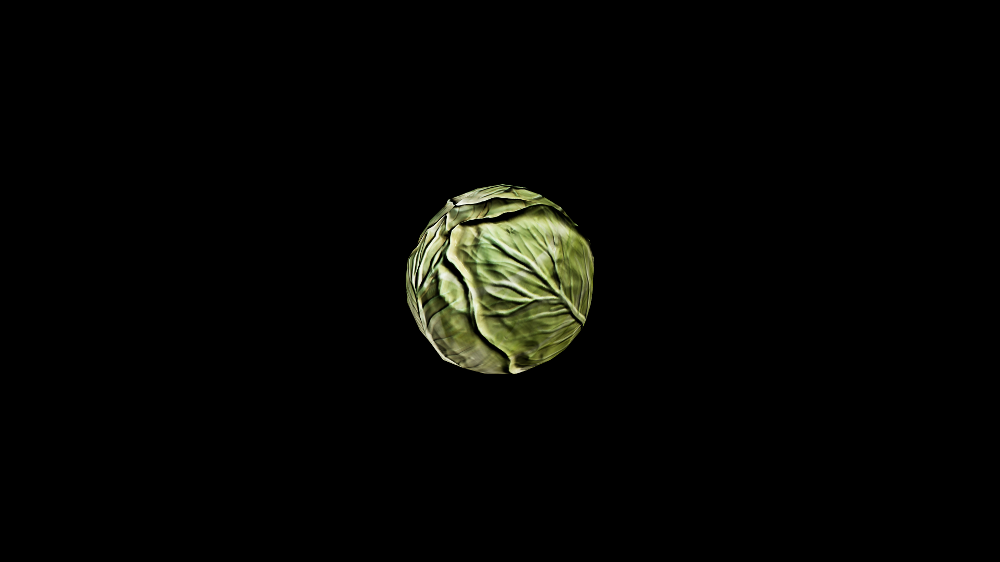

# Cabbage

When fermented, cabbage develops a sharper, more potent essence that strengthens the gut and bolsters the body’s resistance to disease. In alchemy, its crisp green leaves are valued for their grounding and purifying qualities, often used in tonics that cleanse the body of toxins, dispel minor hexes, and restore balance to the humors.

## Item stats

  
Item stats

  <table>
    <tr><th>Weight</th><td>0.0</td></tr>
    <tr><th>Value</th><td>0.0</td></tr>
    <tr><th>Armor</th><td>0.0</td></tr>
  </table>

