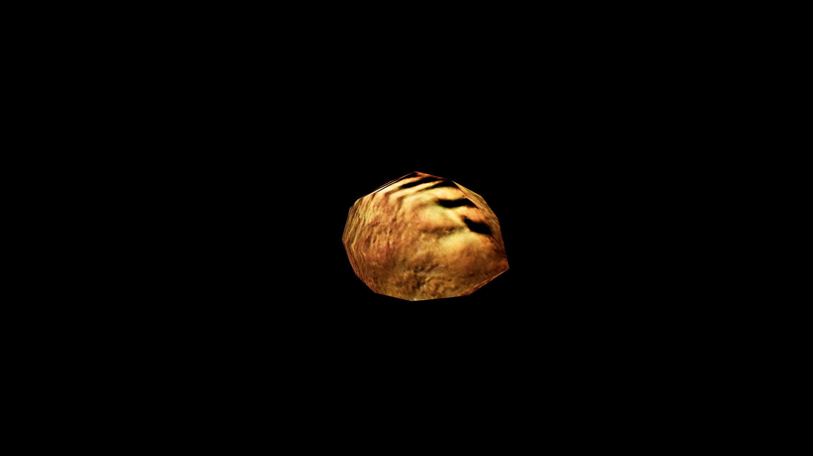

# Cake

Fruit‑filled cakes are often used in potions of vitality and longevity, their sweetness mingling with the restorative magic of the berries within. Rich, spiced cakes infused with cinnamon or clove are believed to ward off evil spirits and ill fortune, especially when served during winter feasts. A freshly baked cake can be enchanted to preserve happiness, restore energy, or strengthen bonds between companions when shared.

## Item stats

  
Item stats

  <table>
    <tr><th>Weight</th><td>0.0</td></tr>
    <tr><th>Value</th><td>0.0</td></tr>
    <tr><th>Armor</th><td>0.0</td></tr>
  </table>

