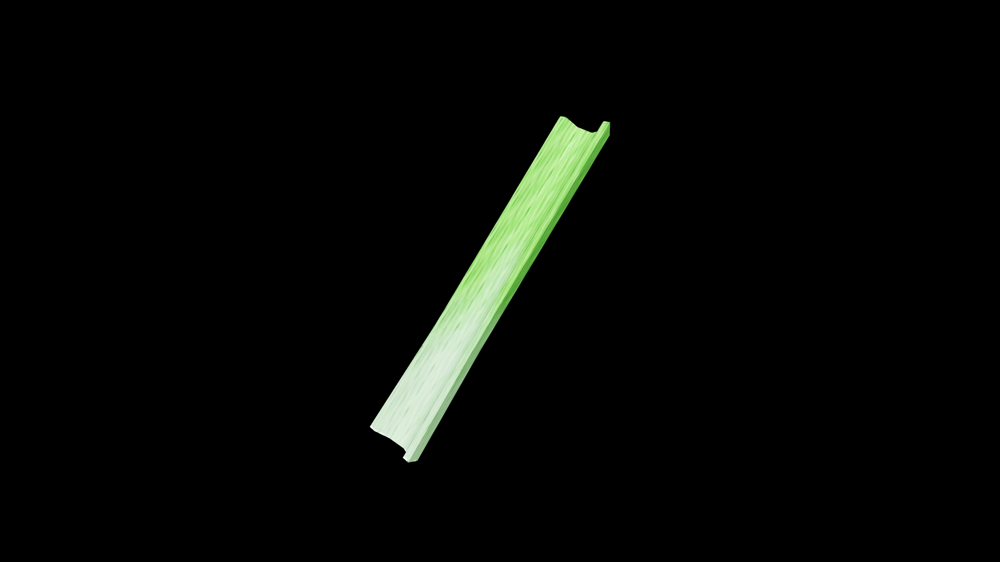

# Celery

Celery grows in tall, ribbed stalks of crisp green, their sharp, clean scent cutting through the air like a fresh breeze. In potioncraft, it is prized not for sweetness but for its invigorating, cleansing nature—stalks steeped in boiling water yield a bright, herbal brew that flushes away lingering toxins and banishes sluggishness from body and mind.

## Item stats

  
Item stats

  <table>
    <tr><th>Weight</th><td>0.0</td></tr>
    <tr><th>Value</th><td>0.0</td></tr>
    <tr><th>Armor</th><td>0.0</td></tr>
  </table>

