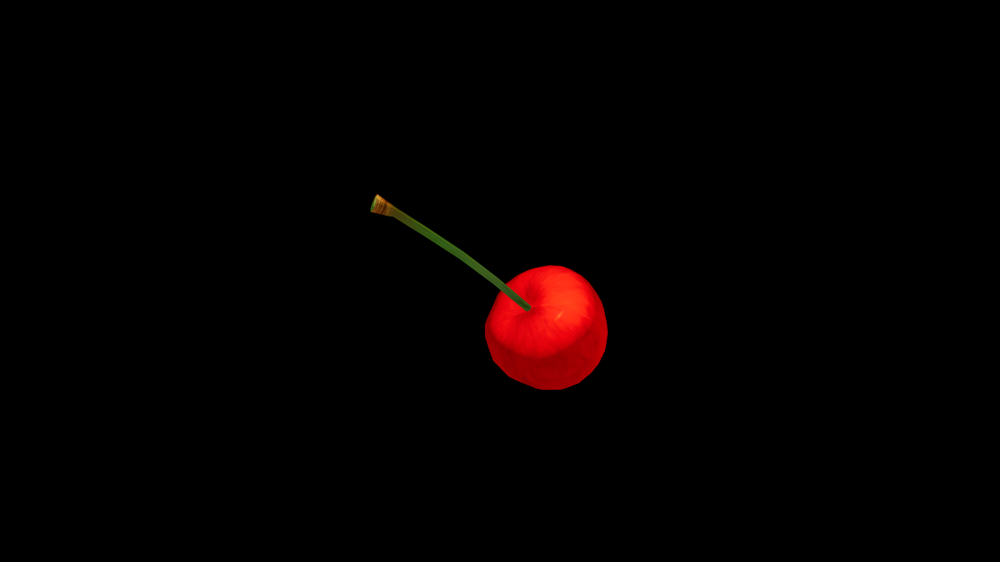

# Cherry

Bursting with sweet‑tart juice, they are cherished by potion‑makers for their quick, bright magic—able to lift melancholy, stir courage, and renew flagging energy in an instant. The pits, though small, hide a potent kernel of warmth said to ward off nightmares when carried as a charm. They hang like drops of polished glass from their slender stems, their skins shimmering in shades of ruby, crimson, or near‑black garnet.

## Item stats

  
Item stats

  <table>
    <tr><th>Weight</th><td>0.0</td></tr>
    <tr><th>Value</th><td>0.0</td></tr>
    <tr><th>Armor</th><td>0.0</td></tr>
  </table>

