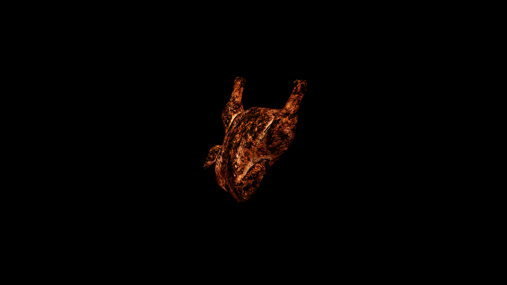

# Chicken

The meat, when simmered into rich broths, is believed to knit strength back into weary bones and draw out lingering sickness, making it a cornerstone of countless healing remedies. Feathers, light yet resilient, are often used in talismans to protect travelers from misfortune, while powdered eggshells are blended into elixirs that fortify the body against curses of weakness.

## Item stats

  
Item stats

  <table>
    <tr><th>Weight</th><td>0.0</td></tr>
    <tr><th>Value</th><td>0.0</td></tr>
    <tr><th>Armor</th><td>0.0</td></tr>
  </table>

