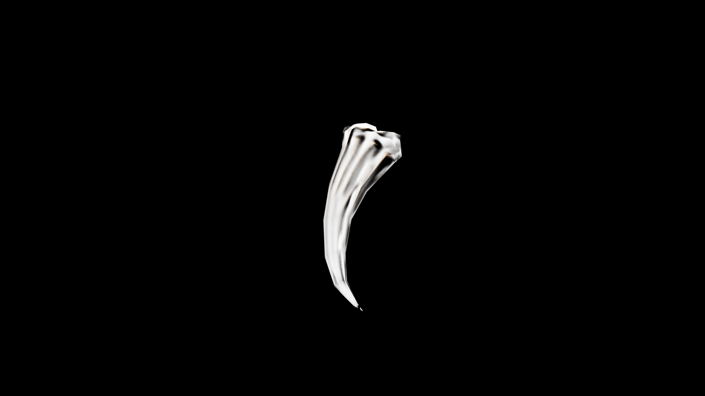

# Claw

Claws are remnants of predatory beasts, hardened keratin or bone honed to lethal points through a lifetime of hunting. In potioncraft, they are valued not for nourishment but for the raw, distilled essence of ferocity they carry. When ground into fine powder, a claw can be infused into elixirs to grant the drinker heightened reflexes, sharper senses, or bursts of predatory strength. The claw of a mundane creature holds modest power, but the talons of magical beasts—gryphons, wyverns, dire wolves—are potent catalysts in combat draughts and protective charms.

## Item stats

  
Item stats

  <table>
    <tr><th>Weight</th><td>0.0</td></tr>
    <tr><th>Value</th><td>0.0</td></tr>
    <tr><th>Armor</th><td>0.0</td></tr>
  </table>

