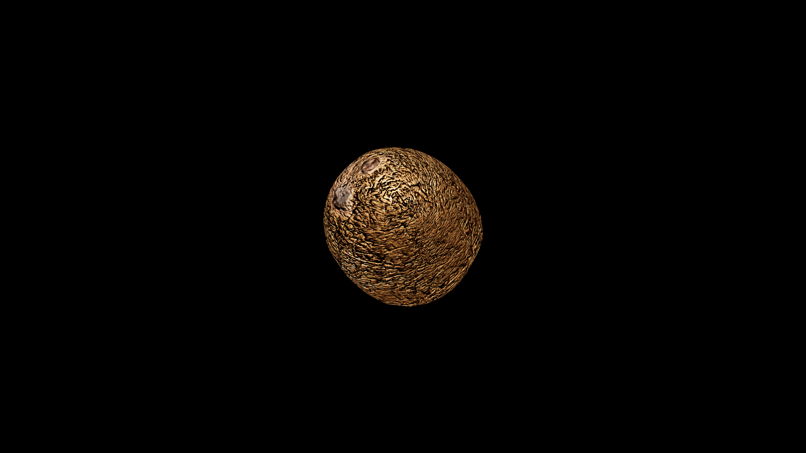

# Coconut

Coconuts are the sealed treasures of tropical shores, their rough, fibrous shells guarding both sweet, nourishing water and rich, creamy flesh. In potioncraft, they are revered for their dual nature: the water, light and cooling, is a natural purifier, used in restorative draughts to cleanse the body of poisons and soothe fevers; the flesh, hearty and full of sustaining magic, fortifies the body and calms the spirit. The shell itself, once polished, is often carved into talismans said to repel bad luck and ward against drowning at sea.

## Item stats

  
Item stats

  <table>
    <tr><th>Weight</th><td>0.0</td></tr>
    <tr><th>Value</th><td>0.0</td></tr>
    <tr><th>Armor</th><td>0.0</td></tr>
  </table>

