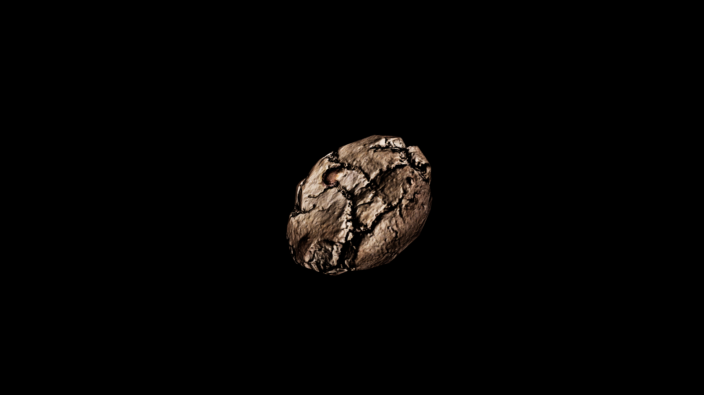

# Cookie

Small, sweet creations baked with a touch of warmth, memory, and—when in the hands of a skilled alchemist—powerful enchantment. Their crisp edges and soft centers make them ideal vessels for carrying subtle magics, as sugar binds and preserves delicate spellwork. Honey‑drizzled cookies are known to soothe the spirit and mend frayed tempers, while spiced varieties laced with cinnamon or clove are often given as charms to ward against envy and ill will. Chocolate‑studded cookies are believed to inspire creativity and boldness, making them popular among traveling bards and artisans.

## Item stats

  
Item stats

  <table>
    <tr><th>Weight</th><td>0.0</td></tr>
    <tr><th>Value</th><td>0.0</td></tr>
    <tr><th>Armor</th><td>0.0</td></tr>
  </table>

