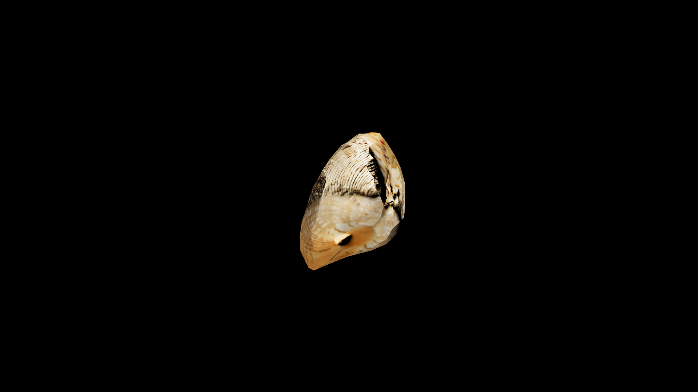

# Crab

 Crab meat, when simmered into a broth, is said to restore stamina, steady the nerves, and fortify the body against illness, making it a favored remedy for sailors and soldiers. The powdered shell, rich with sea‑magic, is often added to protective charms or salves meant to guard against physical harm and hostile enchantments. In potioncraft, they are valued for their dual essence—defensive resilience from the shell and invigorating vitality from the flesh. 

## Item stats

  
Item stats

  <table>
    <tr><th>Weight</th><td>0.0</td></tr>
    <tr><th>Value</th><td>0.0</td></tr>
    <tr><th>Armor</th><td>0.0</td></tr>
  </table>

