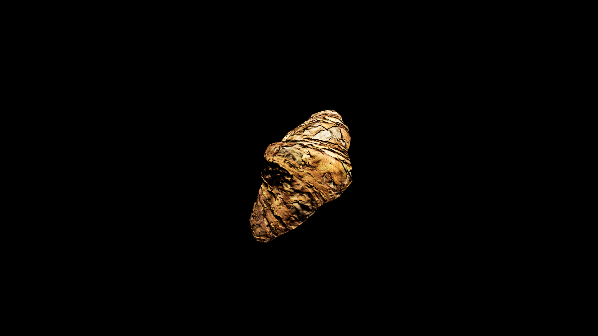

# Croissant

Croissants are delicate, crescent‑shaped pastries whose countless buttery layers are said to trap the whispers of dawn’s first breeze. In potioncraft, they are valued less for raw magical potency and more for their unique ability to carry enchantments in a subtle, lingering way—spells baked into a croissant seep into the eater’s spirit slowly, like sunlight warming the skin. Freshly baked croissants, still warm from the oven, are often infused with calming charms, making them a favored breakfast for diplomats and peacekeepers before tense negotiations. Sweet varieties glazed with honey or filled with fruit are used in restorative magic to mend the heart and dispel melancholy, while savory ones layered with herbs or cheese can bolster courage and sharpen focus.

## Item stats

  
Item stats

  <table>
    <tr><th>Weight</th><td>0.0</td></tr>
    <tr><th>Value</th><td>0.0</td></tr>
    <tr><th>Armor</th><td>0.0</td></tr>
  </table>

