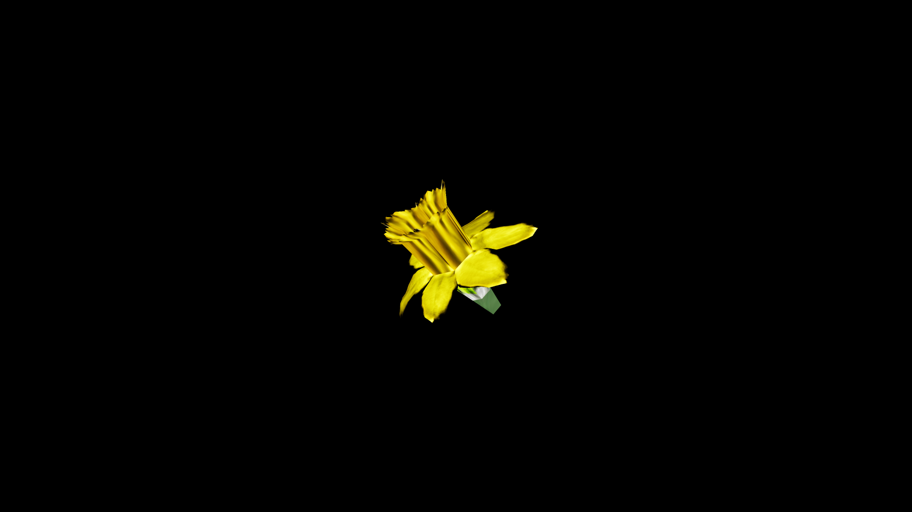

# Dafodil

 Fresh petals steeped in warm honeywater create a draught that lifts sorrow, clears lingering winter weariness, and inspires creativity. Their bulbs, carefully prepared, are said to hold subtle protective magic—able to ward away illness, melancholy, and certain fae enchantments when powdered and carried in a charm pouch.

In countryside lore, daffodils planted near a home are a promise of good fortune for the coming year, but cutting the first bloom before sunrise is thought to invite bad luck.

## Item stats

  
Item stats

  <table>
    <tr><th>Weight</th><td>0.0</td></tr>
    <tr><th>Value</th><td>0.0</td></tr>
    <tr><th>Armor</th><td>0.0</td></tr>
  </table>

