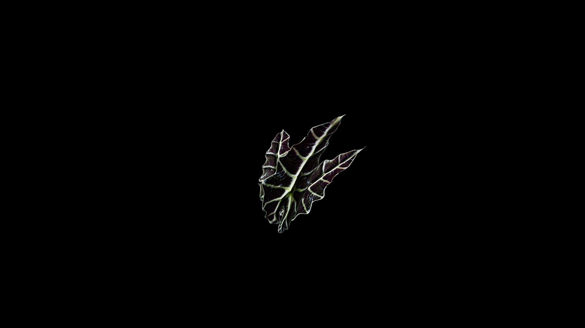

# Dragon Fern

Dragon Ferns are ancient, flame‑veined plants said to have first sprouted where dragons shed their scales. Their fronds unfurl in deep green and crimson, the veins glowing faintly in dim light as though lit from within by embers. In potioncraft, dragon ferns are prized for their potent, volatile magic—fresh fronds ground into paste can grant bursts of strength and courage, while dried leaves steeped into tea are said to awaken latent magical ability. However, their power is unpredictable, and inexperienced alchemists risk burns or uncontrolled magical surges if they mishandle the plant.

## Item stats

  
Item stats

  <table>
    <tr><th>Weight</th><td>0.0</td></tr>
    <tr><th>Value</th><td>0.0</td></tr>
    <tr><th>Armor</th><td>0.0</td></tr>
  </table>

