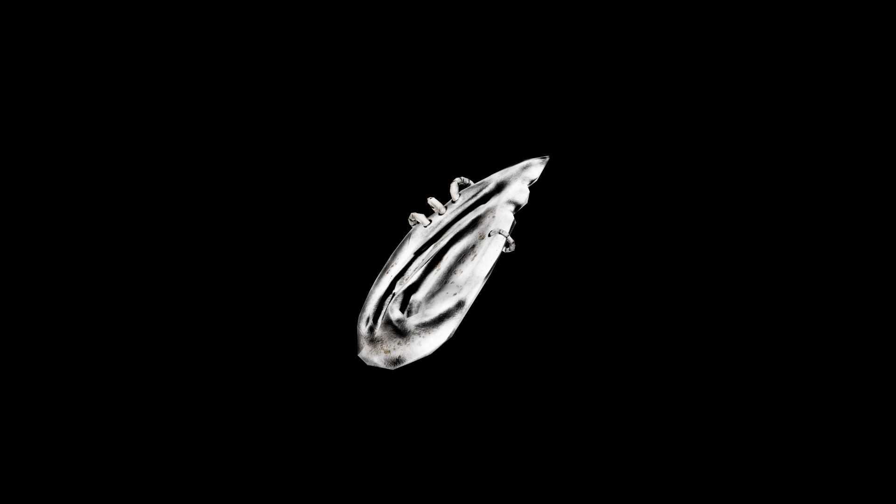

# Ear

They are said to retain faint echoes of every sound they heard in life—secrets, cries, whispered promises—making them a rare but powerful tool in magic tied to perception and knowledge. When steeped into certain brews, they can grant the drinker heightened hearing, the ability to discern truth from lies, or even to eavesdrop on distant conversations carried by the wind.

## Item stats

  
Item stats

  <table>
    <tr><th>Weight</th><td>0.0</td></tr>
    <tr><th>Value</th><td>0.0</td></tr>
    <tr><th>Armor</th><td>0.0</td></tr>
  </table>

