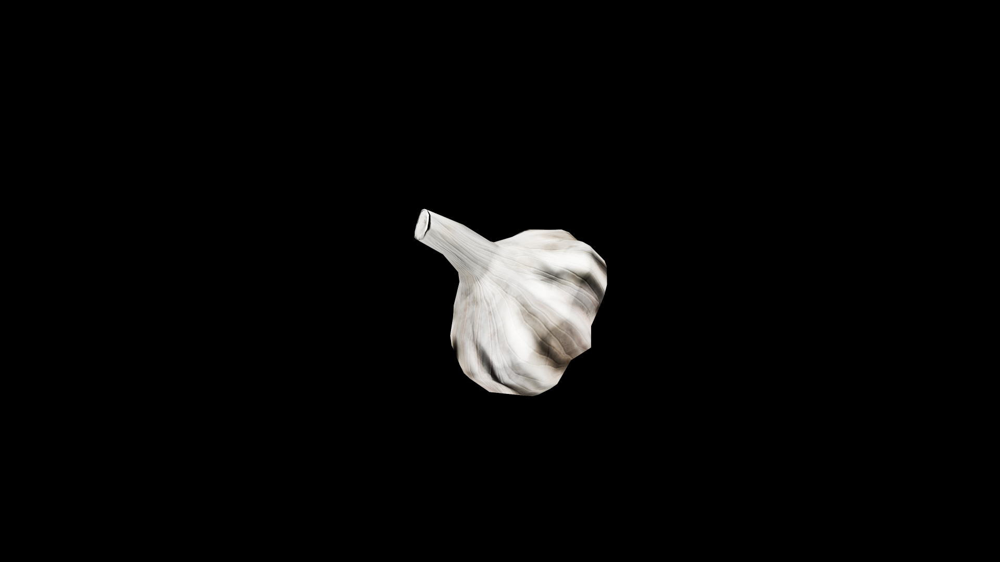

# Garlic

Garlic grows in clustered bulbs beneath the earth, each clove wrapped in paper‑thin skin and steeped in the pungent fire of the soil. Its scent is said to drive away not only vermin and sickness but also restless spirits, curses, and creatures born of shadow. Crushed cloves release a sharp, biting essence that can purge toxins, cleanse the blood, and strengthen the heart, making it a staple in tonics for warriors and travelers.

## Item stats

  
Item stats

  <table>
    <tr><th>Weight</th><td>0.0</td></tr>
    <tr><th>Value</th><td>0.0</td></tr>
    <tr><th>Armor</th><td>0.0</td></tr>
  </table>

