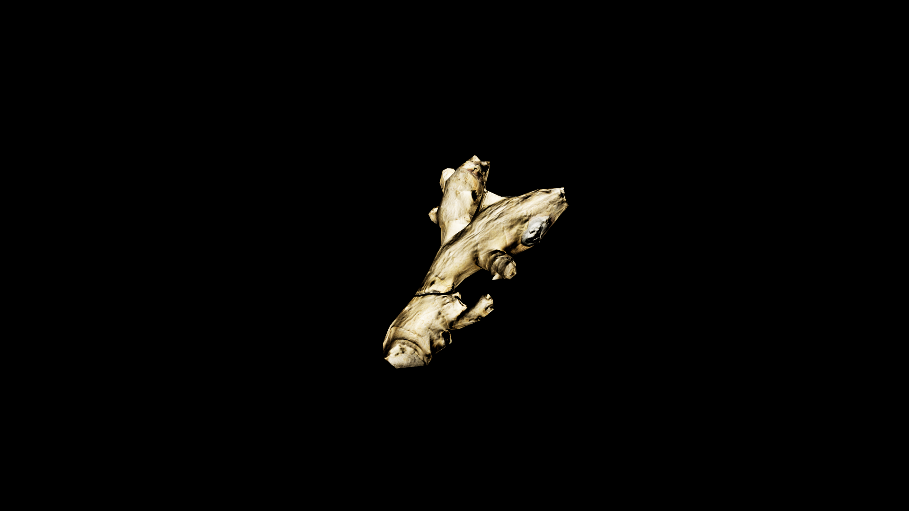

# Ginger Root

Ginger Root is a twisted, knotted treasure of the earth, its warm, golden flesh hidden beneath a skin as rough as old parchment. It carries the fire of the soil and the spark of distant suns, its sharp, fragrant bite awakening the senses the moment it’s cut. Ginger is a herald of movement and change—its heat stirs sluggish magic, pushes poison from the body, and sets weary hearts beating with new resolve. 

## Item stats

  
Item stats

  <table>
    <tr><th>Weight</th><td>0.0</td></tr>
    <tr><th>Value</th><td>0.0</td></tr>
    <tr><th>Armor</th><td>0.0</td></tr>
  </table>

