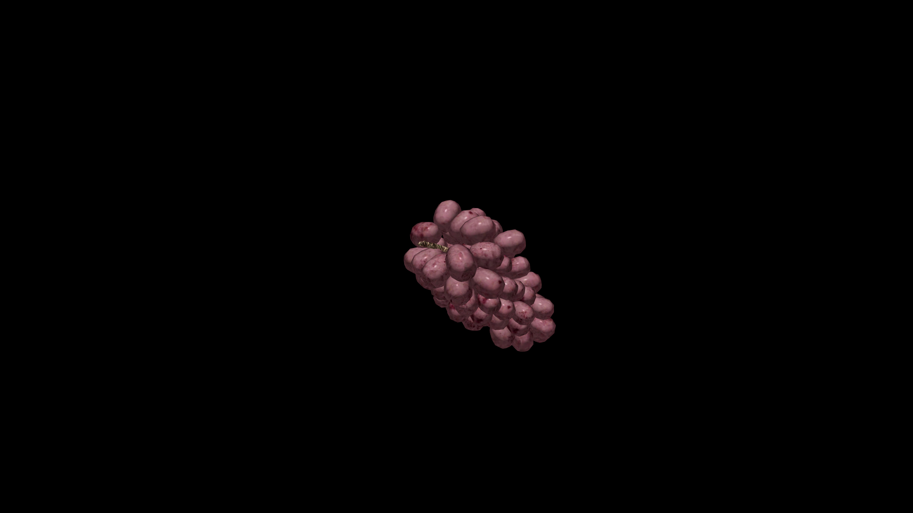

# Grape

Grapes are droplets of sunlight and rain, gathered in tight clusters that swell with sweetness or tang depending on the land that nurtures them. Their skins glisten in hues of deep amethyst, pale green, or golden amber, each color humming with its own kind of magic. Fresh grapes can revive a weary traveler, their juice stirring warmth back into tired limbs, while fermented vintages are often laced with enchantments to heal, embolden, or coax forth hidden truths.

## Item stats

  
Item stats

  <table>
    <tr><th>Weight</th><td>0.0</td></tr>
    <tr><th>Value</th><td>0.0</td></tr>
    <tr><th>Armor</th><td>0.0</td></tr>
  </table>

