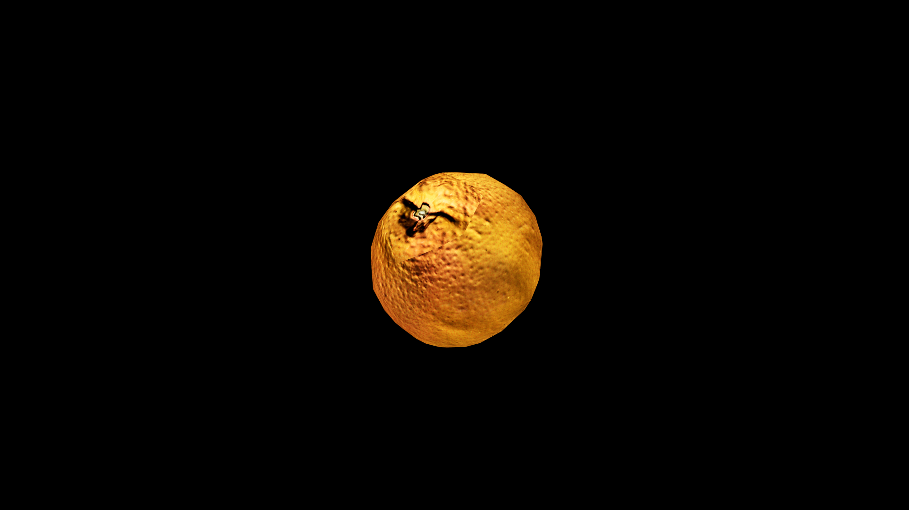

# Grapefruit

Grapefruit hangs heavy on its branches, their round forms blushing pink, gold, or deep ruby beneath a skin that releases a sharp, invigorating scent when cut. Their flavor walks the line between sweet and biting, a taste said to jolt the mind awake and banish lingering gloom. Healers often prize their juice for clearing away sluggishness—both of the body and of the spirit—while traveling mages keep candied slices in their packs to steady focus during long, exhausting work.

## Item stats

  
Item stats

  <table>
    <tr><th>Weight</th><td>0.0</td></tr>
    <tr><th>Value</th><td>0.0</td></tr>
    <tr><th>Armor</th><td>0.0</td></tr>
  </table>

