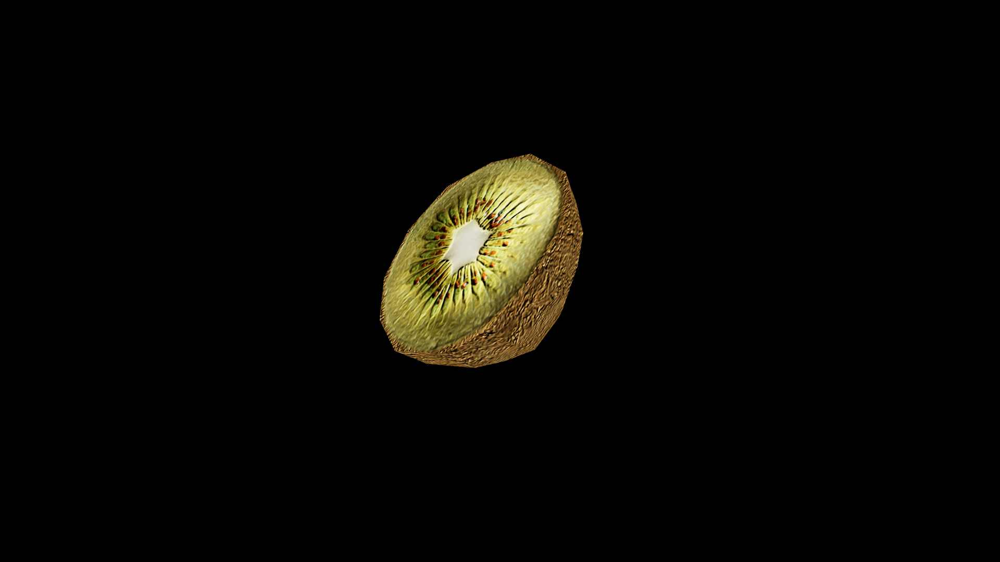

# Kiwi

Kiwi is a small, unassuming fruit at first glance—its skin rough and brown like weathered leather, concealing a heart of vivid green shot through with a ring of tiny black seeds. Yet those who work in the deeper arts know its flesh holds a strangely balanced magic, a union of sweet and tart that seems to draw opposites into harmony. When sliced, the fruit releases a scent both bright and earthy, as if it remembers the sun above and the soil below equally well.

## Item stats

  
Item stats

  <table>
    <tr><th>Weight</th><td>0.0</td></tr>
    <tr><th>Value</th><td>0.0</td></tr>
    <tr><th>Armor</th><td>0.0</td></tr>
  </table>

