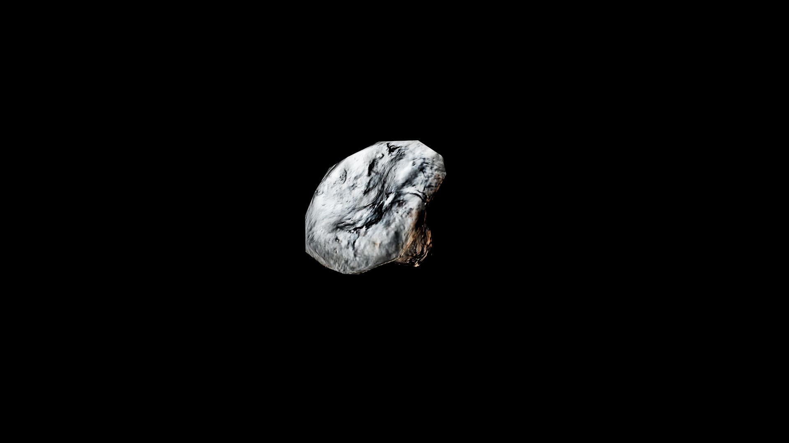

# Lactarius

Lactarius is a curious woodland mushroom, its cap smooth and often ringed with subtle patterns that seem to echo the ripples of still water. When cut or broken, it bleeds a thick, milky sap—sometimes white, sometimes tinted in hues of orange or crimson—whose taste can range from sweet cream to bitter resin. Forest alchemists speak of this sap as the mushroom’s memory, holding within it the essence of the soil, the rain, and the shadows that raised it.

Gathering lactarius is not without risk. Some varieties nourish and heal, their sap a gentle balm for fever or inflammation; others burn on the tongue and in the blood, carrying toxins that dance on the edge between medicine and poison

## Item stats

  
Item stats

  <table>
    <tr><th>Weight</th><td>0.0</td></tr>
    <tr><th>Value</th><td>0.0</td></tr>
    <tr><th>Armor</th><td>0.0</td></tr>
  </table>

