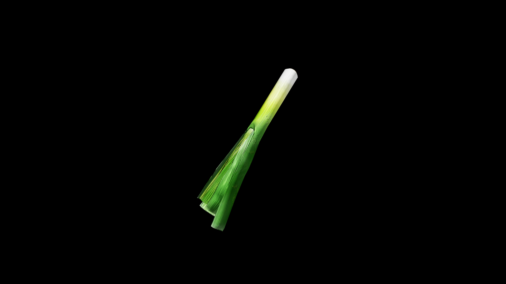

# Leek

 Though humble in appearance, it is considered a plant of quiet strength and steadfastness—its flavor lingering gently, its magic working slowly but surely. Beneath its layers, herbalists say, is the patience of the soil itself, drawn up through seasons of wind, sun, and frost.

In hearth‑magic, leek is a charm against both sickness and strife; a broth simmered with its stalk is thought to knit together frayed bonds as easily as it restores the body’s vigor. 

## Item stats

  
Item stats

  <table>
    <tr><th>Weight</th><td>0.0</td></tr>
    <tr><th>Value</th><td>0.0</td></tr>
    <tr><th>Armor</th><td>0.0</td></tr>
  </table>

