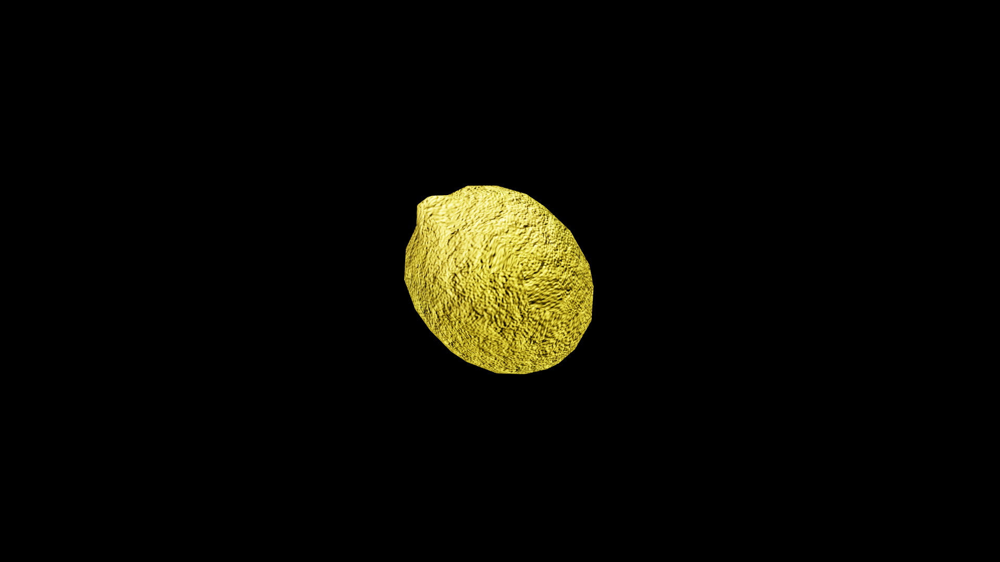

# Lemon

Slice it open, and the air fills with a sharp, invigorating fragrance that cuts through weariness and gloom. Its tart, golden juice is said to hold a spark of cleansing magic, driving away not only physical impurities but also lingering curses and shadow‑born maladies. Herbalists call it “the fruit that wakes the blood,” for even a drop upon the tongue can sharpen the mind and steady the will.

Seafaring traditions prize the lemon as a ward against sickness on long voyages, while healers in the highlands use its zest in talismans meant to protect against deceit.

## Item stats

  
Item stats

  <table>
    <tr><th>Weight</th><td>0.0</td></tr>
    <tr><th>Value</th><td>0.0</td></tr>
    <tr><th>Armor</th><td>0.0</td></tr>
  </table>

