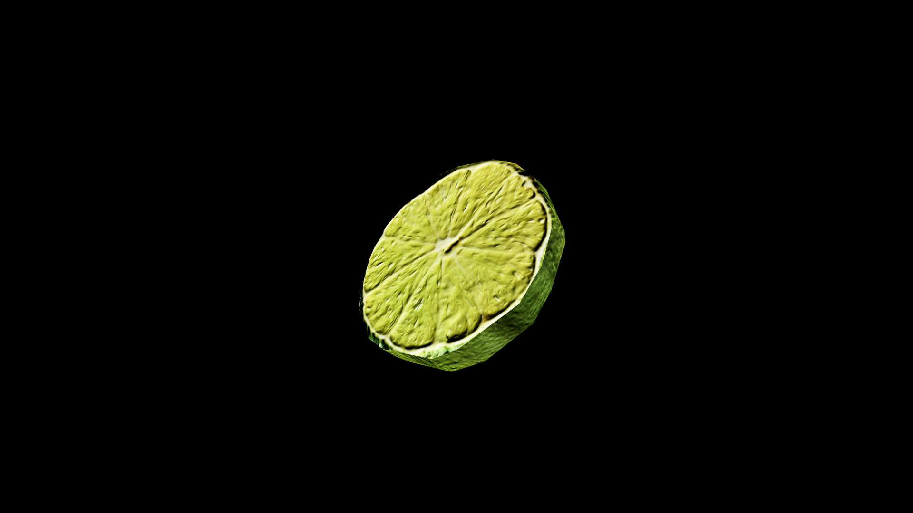

# Lime

Where a lemon is the sun, the lime is the spark—quick, bright, and bracing, able to cut through both physical weariness and the fog of enchantment. Its scent alone can refresh the mind, and its flavor, layered between sweet and biting, is said to awaken courage in those who hesitate.

Sailors carry limes not just to ward off sickness, but to anchor their spirits during long stretches at sea, believing its zest can keep the soul from drifting into dangerous dreams. 

## Item stats

  
Item stats

  <table>
    <tr><th>Weight</th><td>0.0</td></tr>
    <tr><th>Value</th><td>0.0</td></tr>
    <tr><th>Armor</th><td>0.0</td></tr>
  </table>

