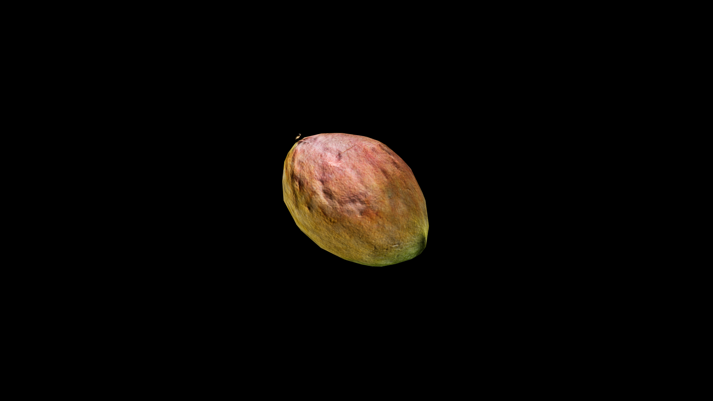

# Mango

When cut, it releases a heady fragrance—sweet, floral, and warm—that seems to carry the memory of sun‑drenched days and gentle summer rains. Its flesh is rich and silky, a treasure that nourishes the body while stirring joy in the spirit. Some say the mango’s sweetness holds a quiet enchantment, coaxing away bitterness of both tongue and heart.

In coastal kingdoms, mango is offered in rites of welcome, said to seal bonds of trust between host and guest.

## Item stats

  
Item stats

  <table>
    <tr><th>Weight</th><td>0.0</td></tr>
    <tr><th>Value</th><td>0.0</td></tr>
    <tr><th>Armor</th><td>0.0</td></tr>
  </table>

