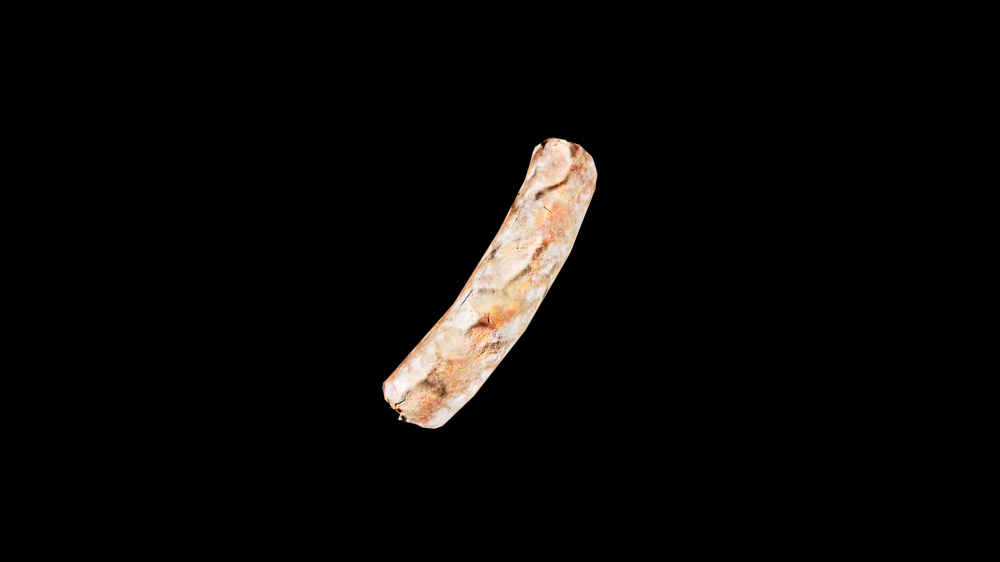

# Melon

Whether pale green, deep orange, or pink as dawn, each variety carries a gentle magic of refreshment and renewal. A single slice can lift the heat‑haze from the mind, quench the thirst of days, and restore the steady rhythm of the heart after long toil. Herbalists say its magic flows slow and deep, like water through the roots of an ancient tree.

## Item stats

  
Item stats

  <table>
    <tr><th>Weight</th><td>0.0</td></tr>
    <tr><th>Value</th><td>0.0</td></tr>
    <tr><th>Armor</th><td>0.0</td></tr>
  </table>

