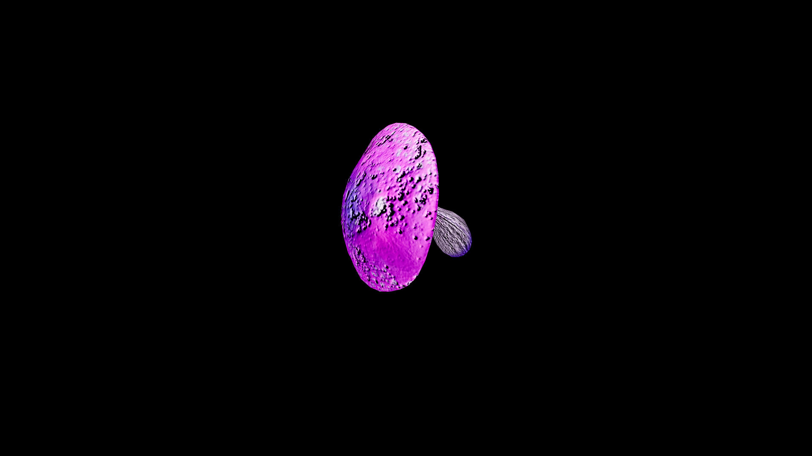

# Mushroom

A mushroom is the quiet breath of the forest floor, appearing where the air is damp and the light is thin. It does not reach for the sun—instead, it drinks from shadow, rain‑soaked soil, and the slow decay of what has been. Each variety is its own riddle: some nourish, some heal, some kill, and a few slip between those boundaries as they please. To those who work in the deeper arts, mushrooms are not plants at all, but the listening ears of the earth—spreading unseen beneath the ground, carrying whispers from root to root.

## Item stats

  
Item stats

  <table>
    <tr><th>Weight</th><td>0.0</td></tr>
    <tr><th>Value</th><td>0.0</td></tr>
    <tr><th>Armor</th><td>0.0</td></tr>
  </table>

