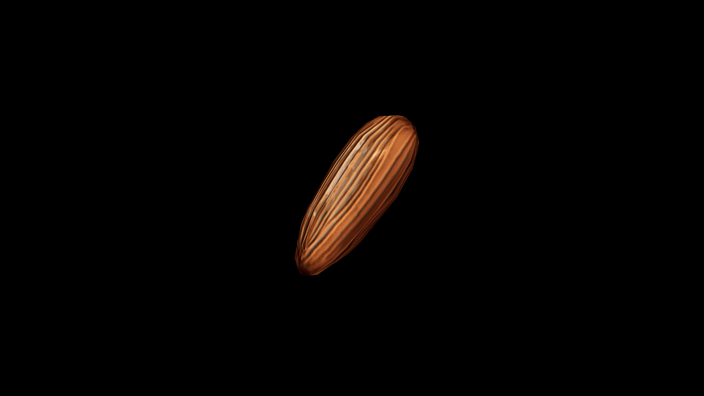

# Nuts

Nuts are the sealed vaults of the forest, each one a hard‑shelled promise hidden among leaves and fallen branches. Within their sturdy casings lies the concentrated essence of the season—rich oils, dense nourishment, and the quiet magic of patience. They are gathered when the air turns crisp, stored against the lean months, and treasured by both beasts and travelers for the strength they bestow. To the old herbalists, nuts are talismans of endurance, each holding a spark of life preserved in slumber until called upon.

## Item stats

  
Item stats

  <table>
    <tr><th>Weight</th><td>0.0</td></tr>
    <tr><th>Value</th><td>0.0</td></tr>
    <tr><th>Armor</th><td>0.0</td></tr>
  </table>

