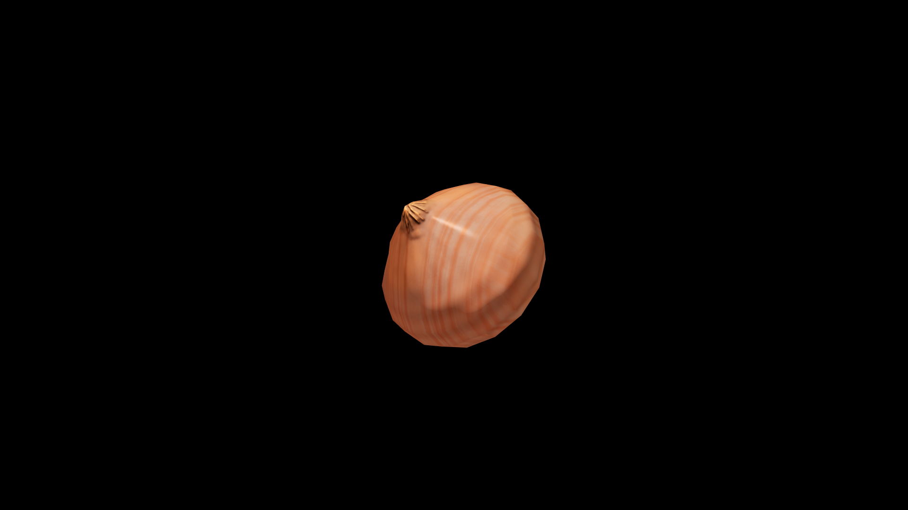

# Onion

Sharp when raw, sweet when coaxed by flame, it is a plant of dual natures—capable of both bite and comfort. Old herbalists say onions draw out what is hidden, whether poison from the body or truth from the tongue, and their pungent scent is a ward against pestilence and ill‑willed spirits.

## Item stats

  
Item stats

  <table>
    <tr><th>Weight</th><td>0.0</td></tr>
    <tr><th>Value</th><td>0.0</td></tr>
    <tr><th>Armor</th><td>0.0</td></tr>
  </table>

