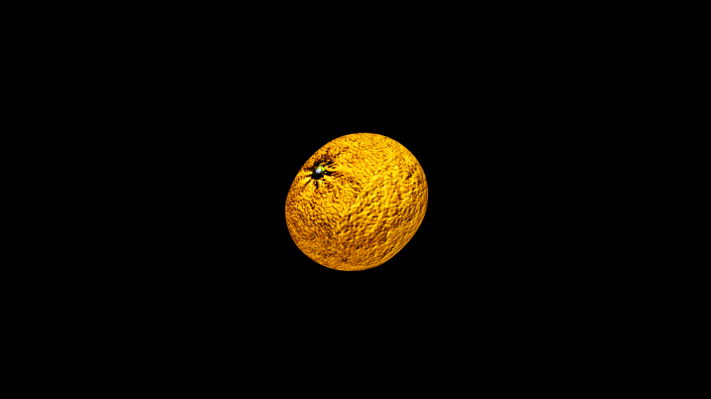

# Orange

When peeled, it releases a bright perfume said to lift gloom from the heart and sweep heavy thoughts from the mind. Old healers speak of oranges as keepers of joy, their golden flesh carrying the warmth of midsummer into the coldest seasons. Its dimpled, fragrant skin guarding segments that hold both sweetness and sharpness in perfect balance.

## Item stats

  
Item stats

  <table>
    <tr><th>Weight</th><td>0.0</td></tr>
    <tr><th>Value</th><td>0.0</td></tr>
    <tr><th>Armor</th><td>0.0</td></tr>
  </table>

