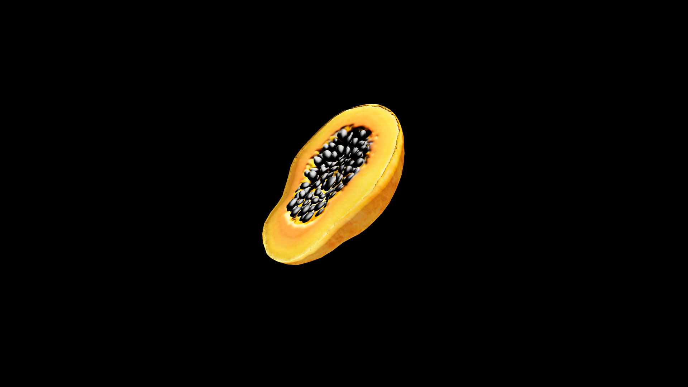

# Papaya

 The fruit of warm rains and endless sun, its golden‑green skin yielding to reveal a heart of coral‑colored flesh scattered with a constellation of glossy black seeds. Its flavor is mellow and fragrant, with a sweetness that lingers like the memory of a summer afternoon. Herbalists and alchemists speak of papaya as a fruit of opening—its flesh softens what is hardened, heals what is bound, and restores gentle flow to both body and magic.

## Item stats

  
Item stats

  <table>
    <tr><th>Weight</th><td>0.0</td></tr>
    <tr><th>Value</th><td>0.0</td></tr>
    <tr><th>Armor</th><td>0.0</td></tr>
  </table>

