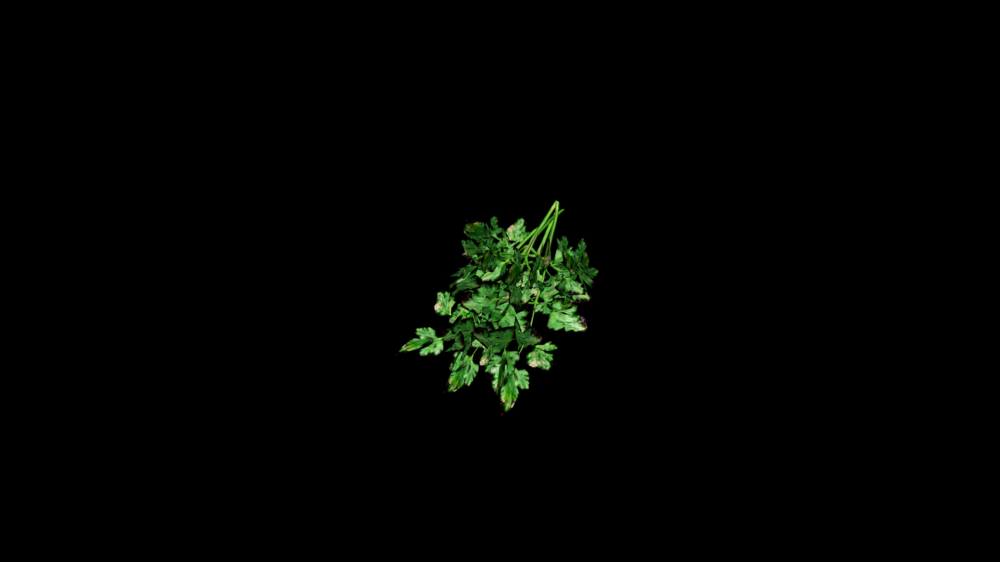

# Parsley

In old hearth‑lore, parsley crowns were worn to ward off drunkenness and ill speech during feasts, while sailors wove sprigs into their clothing for protection against storms at sea.

The bright green herald of the garden, its frilled leaves carrying the sharp scent of fresh growth and the clean bite of early spring. Though often humble at the table, it is a plant of quiet resilience and subtle magic, long used to refresh the breath, steady the heart, and cleanse both body and spirit. Herbalists speak of parsley as a “restoring leaf,” one that coaxes sluggish vitality back into motion and sweeps away lingering weariness like a cool wind over the fields.

## Item stats

  
Item stats

  <table>
    <tr><th>Weight</th><td>0.0</td></tr>
    <tr><th>Value</th><td>0.0</td></tr>
    <tr><th>Armor</th><td>0.0</td></tr>
  </table>

