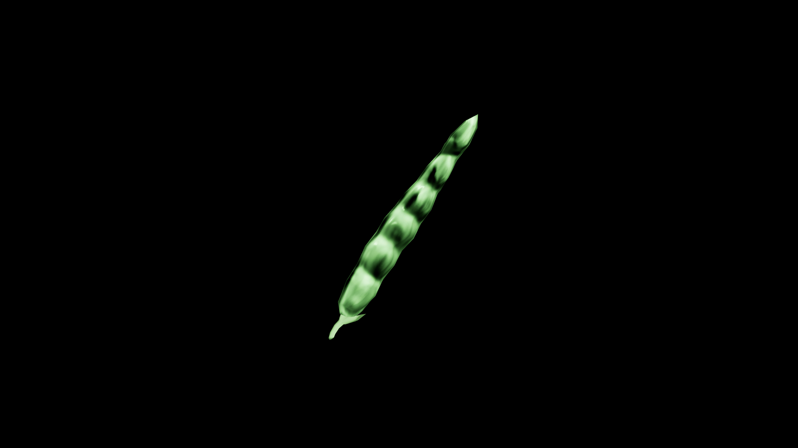

# Pea

Sheltered in pods like nature’s own treasure chests, peas carry the magic of renewal—tiny seeds of vigor that can awaken growth in both body and spirit. Farmers say that to eat the first peas of the season is to take the year’s luck into oneself, sealing a bond with the land until the next harvest.

## Item stats

  
Item stats

  <table>
    <tr><th>Weight</th><td>0.0</td></tr>
    <tr><th>Value</th><td>0.0</td></tr>
    <tr><th>Armor</th><td>0.0</td></tr>
  </table>

