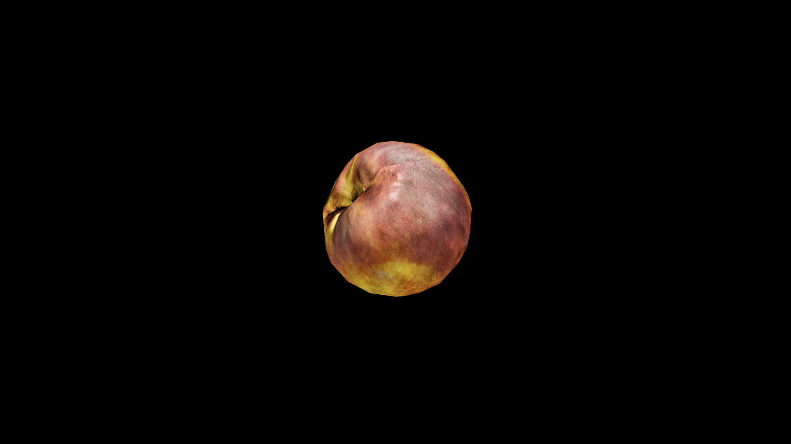

# Peach

Beneath that soft exterior lies flesh that drips with sweetness, fragrant and lush, carrying the magic of ripeness at its peak. Herbalists speak of the peach as a fruit of the heart—it soothes anger, softens sorrow, and awakens gentle longing, as if each bite were a memory of something half‑remembered but dear.

## Item stats

  
Item stats

  <table>
    <tr><th>Weight</th><td>0.0</td></tr>
    <tr><th>Value</th><td>0.0</td></tr>
    <tr><th>Armor</th><td>0.0</td></tr>
  </table>

