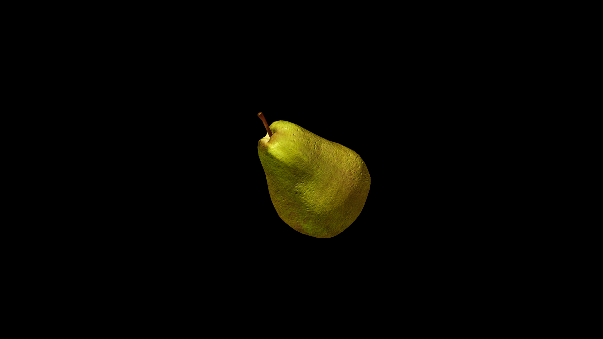

# Pear

 Its skin, whether gold, green, or russet‑brown, hides flesh so tender that it seems to dissolve on the tongue, releasing a sweetness touched with earth. Among orchard keepers, pears are said to carry the magic of balance—between light and shade, warmth and coolness, sweetness and quiet strength.

## Item stats

  
Item stats

  <table>
    <tr><th>Weight</th><td>0.0</td></tr>
    <tr><th>Value</th><td>0.0</td></tr>
    <tr><th>Armor</th><td>0.0</td></tr>
  </table>

