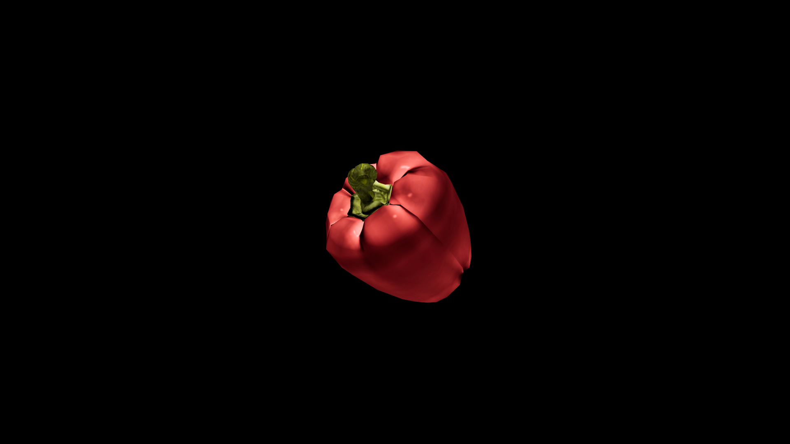

# Pepper

Each tiny sphere holding a heat born far from the place it’s ground. Its scent is sharp and quick, a prickle in the air that stirs the senses and sets the blood moving. Traders call it “the restless spice,” for it carries the taste of long journeys over land and sea, and in the hands of an alchemist it becomes more than seasoning—it is a seed of swiftness, a grain of focus, a whisper to the heart to keep beating strong.

## Item stats

  
Item stats

  <table>
    <tr><th>Weight</th><td>0.0</td></tr>
    <tr><th>Value</th><td>0.0</td></tr>
    <tr><th>Armor</th><td>0.0</td></tr>
  </table>

