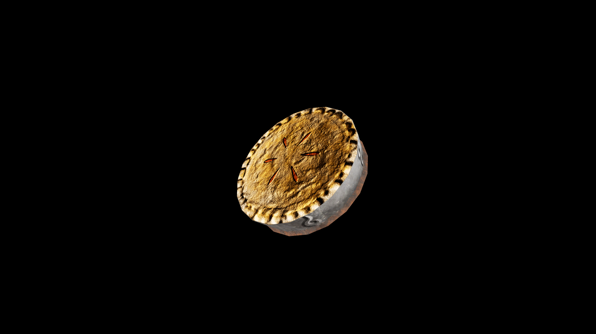

# Pie

Fruit, spice, or savory filling sealed in a golden crust, where heat transforms humble ingredients into something greater than their sum. Its scent drifts like a promise through kitchens and market stalls, drawing people close and softening even the hardest moods. Bakers speak of pies as vessels for intention: a pie baked in joy carries comfort to those who share it, while one baked in anger is said to bring restless dreams.

## Item stats

  
Item stats

  <table>
    <tr><th>Weight</th><td>0.0</td></tr>
    <tr><th>Value</th><td>0.0</td></tr>
    <tr><th>Armor</th><td>0.0</td></tr>
  </table>

