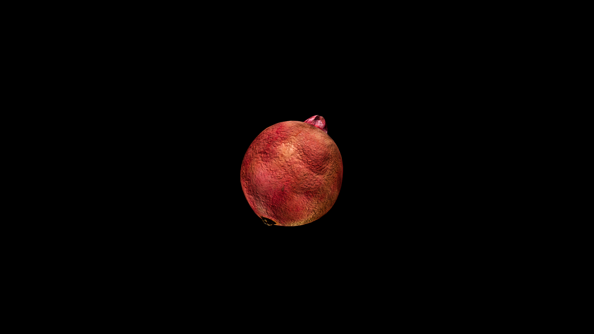

# Pomegranate

Split it open, and a hundred garnet seeds spill into view, each one a bead of living light, sweet on the tongue yet edged with a sharp, lingering tartness. To eat it is to taste abundance and loss together—life at its fullest and the shadow that follows.

## Item stats

  
Item stats

  <table>
    <tr><th>Weight</th><td>0.0</td></tr>
    <tr><th>Value</th><td>0.0</td></tr>
    <tr><th>Armor</th><td>0.0</td></tr>
  </table>

