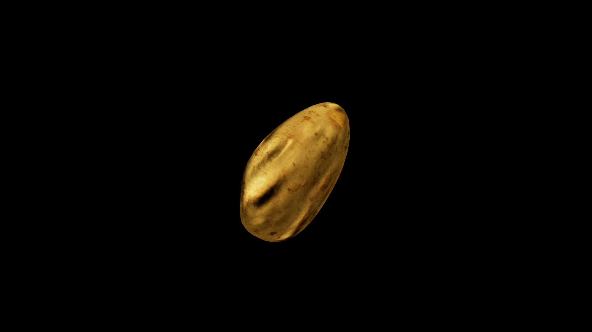

# Potato

A knotted root that swells quietly beneath the soil, gathering the strength of the land in patient silence. Its skin may be rough, spotted, or smooth, but within lies flesh that can feed for days, offering warmth and endurance to those who partake. Farmers call it the “sleeper’s heart,” for its magic rests dormant until touched by fire—only then does it release its full gift of sustenance.

## Item stats

  
Item stats

  <table>
    <tr><th>Weight</th><td>0.0</td></tr>
    <tr><th>Value</th><td>0.0</td></tr>
    <tr><th>Armor</th><td>0.0</td></tr>
  </table>

