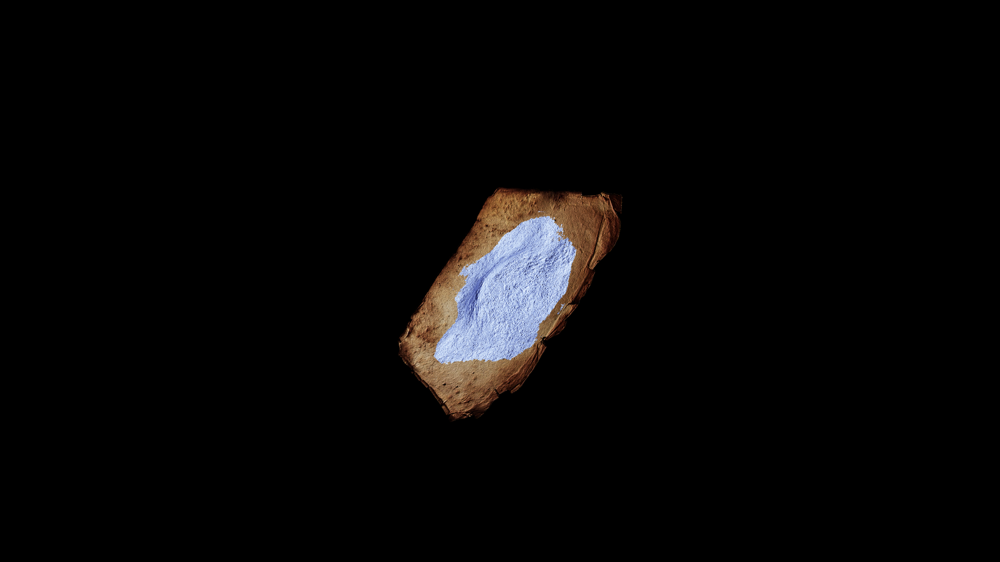

# Powder

Powders are the language of the alchemist written in dust—fine grains ground from root, stone, leaf, or bone, each carrying the essence of what it once was. Light enough to drift on a breath yet potent enough to change the course of a potion, powders are prized for their precision: a pinch can heal, harm, or transform in ways that whole herbs or raw materials cannot. The grinding itself is a quiet magic, releasing and concentrating the spirit of the source into a form that will wait patiently for its moment to act.

## Item stats

  
Item stats

  <table>
    <tr><th>Weight</th><td>0.0</td></tr>
    <tr><th>Value</th><td>0.0</td></tr>
    <tr><th>Armor</th><td>0.0</td></tr>
  </table>

