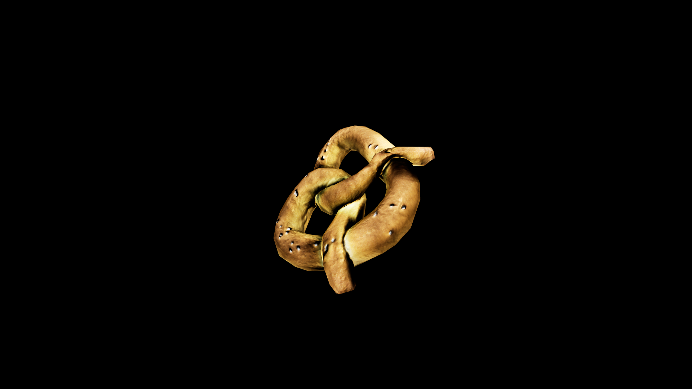

# Pretzel

Twisted into its familiar loop, it has long been a symbol of unity and safe passage, said to bind fortune to the one who eats it without breaking its shape. The bite is a balance of softness and chew, warmth and brine, carrying with it the simple magic of sustenance for the road and protection against mischance.

## Item stats

  
Item stats

  <table>
    <tr><th>Weight</th><td>0.0</td></tr>
    <tr><th>Value</th><td>0.0</td></tr>
    <tr><th>Armor</th><td>0.0</td></tr>
  </table>

